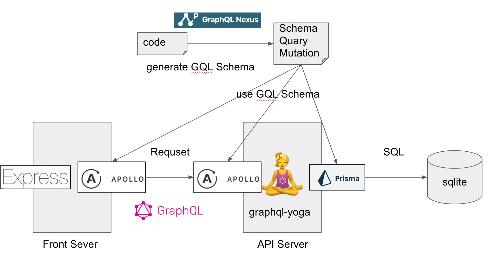

# project.solo-api

This was created during my time as a student at Code Chrysalis”.
This is the weekend project to learn GraphQL and JavaScript.

## Objectives

I try to implement below;

- Create CRUD API with GraphQL.
- Write Tests (Using mock better).
- Seed database.
- Describe APIs.
- Create a basic/simple frontend.

### Summary

#### 👍 What I did well.

- I tried a whole new set of tools from scratch that I didn't learn in lecture.
- I was able to get the whole thing to work with a group of tools that depend on a variety of things.
- By using only schemas as much as possible in later life, we discovered the advantages of schema-driven, consistent client, server and DB development.
- Most of the errors that came up one after another were solved while investigating the operation.

#### 👎 What I could improve.

- With a maximum time limit of two days, he chose to take a risk and choose technology as a hobby.
- I was plagued with a large amount of version and backward/forward compatibility errors due to the use of an underdeveloped tool that was not mature.
- It took more time to understand the tool than to create the feature itself.

#### ↗️ Try next.

- Don't do it thinking you don't want to do it, but do it for fun.
- Start from MVP.

## Getting Started

### Architecture



- Lang - JavaScript/TypeScript
- Server - apollo-server/express
- SchemaGenerator - nexus
- GraphQLClient - prisma
- ORM - prisma
- Database - sqlite3
- SetUp - graphql-yoga
- Other - babel/browserify

### Support Version

- node v12.18.3

Other dependency versions are written on `yarn.lock`.

### How to run the server

1. git clone this repository.

1. install dependencies with `yarn install`.

1. generate GraphQL schema with `yarn generate`.

1. initialize database with `yarn initdb`.

1. start API server with `yarn start:server`

Then you can access the API server `http://localhost:4000/`.
You can try APIs with GraphQL PlayGround.

1. start API server with `yarn start:frontend`

Then you can access the Front server `http://localhost:4010/`.

1. create seed data with `yarn seed`.

### How to change the server

### Schema

GraphQL schema is generated from `src/schema.ts` (using nexus).

If you want to define/modify schema, change this file and type these commands;

`yarn generate`

`yarn build`

### API

Nothing to do.

### Front

If you modify src/front/public/js/draw.json, type the command below;

`yarn frontbuild`

## Specification

See [schema.graphql](https://github.com/bakisunsan/cc13-project.solo-api/blob/master/schema.graphql).

And you can also try with GraphQL Playground `http://localhost:4000/`.

## Todos

- [ ] Fix front javascript problem.

Error occurs in `const { PrismaClient } = require('@prisma/client')` block when running on Chrome.
It may be caused by prisma dependency version.

```
 $ browserify src/front/public/js/draw.js -o src/front/public/js/bundle.js
 Error: Cannot find module 'async_hooks' from '/Users/xxx/ghq/github.com/xxx/cc13-project.solo-api/node_modules/@prisma/client/runtime'
```

- [ ] more Schema
- [ ] more Query/Mutation
- [ ] more Seed data
- [ ] more Test

## Reference

- https://github.com/prisma-labs/graphql-yoga
- https://github.com/prisma/prisma-examples
- https://www.prisma.io/docs/understand-prisma/introduction/
- https://github.com/matiassingers/awesome-readme
